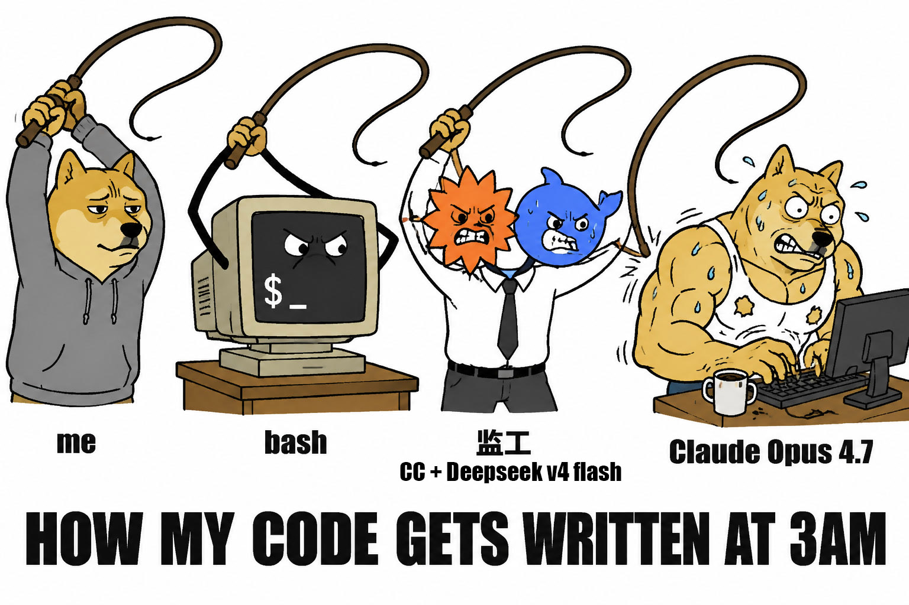

# Claude Code Tmux Orchestrator

让一个 Claude Code 实例（监工）监督另一个 Claude Code 实例（工人）在 tmux 里无人值守地完成大型开发任务。

**核心理念**：Claude Code 能力很强，但有两个致命弱点 — (1) 配额不稳（424 错误）会自动重试但不保证恢复，(2) 上下文会满。通过 **tmux 做进程隔离 + 两个 Claude 分工**，让监工通过文件协议和脚本驱动工人，配合心跳看门狗，实现**睡一觉醒来代码写好了**。



## 架构

```
Terminal A (纯 shell, 无 Claude)
  orch-loop.sh ──心跳──▶ Terminal B (监工 Claude)
                              │ tmux send-keys + orch-* 脚本
                              ▼
                         Terminal C (工人 Claude)
                              在项目目录里干活
                              写 dev_log.md 汇报进度
```

- **Terminal A** — `orch-loop.sh` 心跳看门狗。轮询 B 和 C 的状态；如果两边都 IDLE 但任务没做完，给监工发"继续"唤醒。
- **Terminal B** — 监工 Claude，加载 `tmux-orchestrator` skill。只管写粗粒度 TODO、派任务、读工人进度、处理异常。**绝不写代码**。
- **Terminal C** — 工人 Claude，加载 `checkpoint-worker` skill。只管撸码，按协议写 `dev_log.md` 报告进度。

## 核心设计

### 1. 监工从不看工人屏幕

监工只通过 7 个 CLI 脚本和文件协议感知工人状态。每个脚本返回紧凑 JSON（~10 行），不把 tmux capture-pane 的几千行灌给监工。**单次循环上下文增量控制在 ~30 行内**。

### 2. 两级规划

- **监工**：写粗粒度 TODO（5-10 个里程碑），比如"实现登录后端"
- **工人**：接到 T1 后，先写详细 spec.md（拆成 S1.1 S1.2 ... 十几个子任务），让人 review 一次。从 T2 起自主拆分，不用再 review。

### 3. 文件即协议

所有状态都在文件里，不靠监工记忆：

| 文件 | 谁写 | 用途 |
|------|------|------|
| `.orch/todo.md` | 监工 | 粗粒度里程碑清单 |
| `.orch/spec.md` | 工人 | 详细子任务拆分 |
| `.orch/dev_log.md` | 工人（追加） | 进度流水账，每行一个事件 |
| `.orch/checkpoint.md` | 工人 | compact 前的断点续传上下文 |
| `.orch/orch-loop.env` | 用户 | 项目级心跳配置 |

### 4. 心跳看门狗

`orch-loop.sh` 是纯 bash，不占 Claude 上下文。每 60 秒检查监工和工人的 tmux pane 状态 — 如果两边都 IDLE 超过 3 个轮询周期但 TODO 还没做完，就给监工发"继续"。任务全部完成则自动退出。

### 5. 上下文防溢出

监工主动在合适时机（~50 轮 / 大型 milestone 前）触发 `orch-compact`，命令工人写入 checkpoint.md（工人当前心智模型），然后对工人执行 `/compact`，compact 后验证恢复。工人丢掉的上下文由 checkpoint.md 补回来。

## 前置准备

你需要先装好这些（缺一不可）：

```bash
# 1. tmux — macOS 用 Homebrew，Linux 用包管理器
brew install tmux        # macOS
sudo apt install tmux    # Ubuntu/Debian

# 2. Claude Code CLI（npm 全局安装）
npm install -g @anthropic-ai/claude-code

# 3. Python 3.8+（macOS 通常已自带）
python3 --version
```

装好以后验证：

```bash
tmux -V           # 比如 tmux 3.4
claude --version  # 比如 2.1.142
```

## 安装

```bash
# 安装到 Claude Code skills 目录
git clone https://github.com/ricekills/claude-tmux-orchestrator.git
cp -r claude-tmux-orchestrator/tmux-orchestrator ~/.claude/skills/
cp -r claude-tmux-orchestrator/checkpoint-worker ~/.claude/skills/

# 验证
ls ~/.claude/skills/tmux-orchestrator/scripts/orch-status
```

## 使用

### 1. 启动监工

```bash
tmux new -s orch
claude
# 输入: "加载 tmux-orchestrator skill，项目目录 /path/to/project"
```

监工会自动走 Phase 0 bootstrap：问你 4 个问题（项目目录、session 名、轮询间隔），然后写 `.orch/orch-loop.env`。

### 2. 启动工人

```bash
tmux new -s worker
cd /path/to/project
claude
# 等待监工给你 prompt 贴进去
```

### 3. 启动心跳

```bash
bash ~/.claude/skills/tmux-orchestrator/scripts/orch-loop.sh /path/to/project
```

### 4. 跟监工对话

告诉监工你想做什么（1-3 句话）。监工写 TODO → 你 `approved` → 监工派工人写 spec → 你 `go` → 监工开始循环派任务。

之后你就不用管了。可以睡觉、出门、做别的。回来时 `cat .orch/todo.md` 看哪些 `[x]` 了。

## 监工的 CLI 工具箱

| 命令 | 用途 |
|------|------|
| `orch-status <session>` | 工人当前状态 JSON（state/phase/elapsed/error 等 ~10 字段）|
| `orch-send <session> --text "..."` | 可靠发送 prompt（处理长文本被 tmux 截断的 bug）|
| `orch-esc <session>` | 中断工人当前操作（双 ESC）|
| `orch-wait-completion <session> --marker-before <hash>` | 阻塞等待工人完成当前任务，返回 COMPLETED/INTERRUPTED/STALLED/ERROR/TIMEOUT |
| `orch-retry <session>` | 404/network 错误后重试（带冷却，最多 3 次/10 分钟）|
| `orch-compact <session>` | 完整 checkpoint + /compact + 恢复验证流程 |
| `orch-tail-log [N]` | 查看 dev_log.md 最后 N 行 |

监工 **绝不直接运行 tmux**。所有 tmux 交互封装在这些脚本里。

## 完成检测协议

工人完成一个 TODO 后必须在 `dev_log.md` 写：

```
[T3 DONE] subtasks: S3.1✓ S3.2✓ S3.3 skipped(legacy) S3.4✓
```

监工通过 `orch-wait-completion` 检测 BUSY→IDLE 转换 + 新的 completion marker，然后 grep dev_log 确认 `[T<N> DONE]`。

## 已验证的场景

基于对 Claude Code v2.1.142 TUI 的 ~10 小时实证研究：

- 长 prompt 被 tmux 截断（Enter 变成换行）
- 完成动词在不同渲染间不稳定（`Churned for 23s` → `Cooked for 23s`）
- 反馈弹窗吞掉第一个按键
- 底部状态栏在长输入时被推出屏幕
- 状态行在重度流式输出时完全消失
- `/compact` 后状态恢复

详见 SKILL.md 内嵌的状态检测逻辑。

## 要求

- macOS / Linux（有 tmux）
- Claude Code CLI
- Python 3.8+
- tmux（用户需手动开 3 个 terminal）

## 项目结构

```
tmux-orchestrator/          # 监工 skill
├── SKILL.md                # 监工行为协议（~380 行）
└── scripts/
    ├── orch-status         # 状态检测（Python）
    ├── orch-send           # 可靠发送（Python）
    ├── orch-esc            # 中断/清除（Python）
    ├── orch-wait-completion # 阻塞等待（Python）
    ├── orch-retry          # 错误恢复（Python）
    ├── orch-compact        # 上下文压缩（Python）
    ├── orch-tail-log       # 日志查看（Python）
    ├── orch-loop.sh        # 心跳看门狗（Bash）
    └── selftest            # 9/9 自测（Python）

checkpoint-worker/          # 工人 skill
└── SKILL.md                # 工人行为协议（~230 行）
```

## License

MIT
